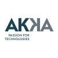
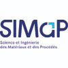

# Profil LinkedIn - Raphaël SCAPOLAN

## 📋 Informations Générales

- **Nom :** Raphaël SCAPOLAN
- **Titre Professionnel :** Développeur Senior .NET / WPF | Intégration IA & Architecture | PhD
- **URL du profil :** https://www.linkedin.com/in/raphaël-scapolan-87812799/

---

## 👤 À Propos

Développeur Senior .NET / WPF & Architecte logiciel, spécialisé dans les ERP complexes, la modernisation d’applications, l’automatisation, et l’intégration IA appliquée.

Depuis plus de 10 ans, je participe à la conception, l’évolution et l’optimisation d’un ERP international utilisé par 80 filiales et 400 000+ utilisateurs, au sein d’une organisation Agile de grande échelle (500+ collaborateurs).

J’ai contribué à une migration majeure sur 5 ans de l’ERP historique (Access/VBA) vers une architecture moderne en C# / WPF, puis à la maintenance évolutive du nouvel ERP et au développement de modules critiques (achats, e‑commerce, interconnexions cXML).

J’intègre aujourd’hui l’IA dans les processus métier : automatisation de traitements (demandes d’achat, factures), extraction intelligente, matching, indexation de codebase, et assistants augmentant la productivité des équipes.

J’ai une expérience avancée de l’ensemble du cycle de vie logiciel — de l’analyse au déploiement — avec un fort ancrage sur les aspects techniques et architecturaux.

J’interviens sur l’architecture et l’écosystème technique complet : client lourd, Azure Service Bus, CI/CD, tests automatisés, performance, qualité, et outillage interne.

### Ce que j'apporte :
- Modernisation et migration d’applications legacy
- Architecture logicielle robuste et évolutive
- Automatisation, qualité, tests, CI/CD
- Intégration IA pragmatique et orientée valeur
- Expertise ERP

### Compétences Clés :
**Technos clés :** C#, .NET, WPF, Azure Service Bus, SQL, PowerShell, GitLab, Specflow/Reqnroll, CI/CD, IA (Copilot, GPT, Claude).

---

## 💼 Expérience Professionnelle

### 1. Développeur Senior .NET / WPF — Intégration IA & Architecture
**Entreprise :** CCB | Société internationale d'édition multimédia  
**Durée :** octobre 2015 - aujourd'hui (10 ans 9 mois)  
**Localisation :** Rouen, Normandie, France | Mode hybride  
**Taille d'équipe :** 10 personnes

#### Description :
Développement et maintenance de l'ERP propriétaire de la société (80 filiales, 400 000+ utilisateurs) au sein d'une organisation Agile de grande échelle (500+ collaborateurs).

#### Réalisations Clés :
- **Migration Majeure (5 ans) :** Refonte et migration de l'ERP historique (Access/VBA) vers architecture moderne en C# / WPF
- **Core ERP & E-Commerce :** Développement module d'achats intégré et interconnexion e-commerce (flux cXML)
- **Architecture & Qualité :** Architecture Serveur + Client lourd (Azure Service Bus), tests automatisés (Specflow/Reqnroll)
- **Intégration IA :** Automatisation traitements (demandes, factures), extraction intelligente, matching, indexation codebase

#### R&D & Outillage Interne :
- Indexation des règles métier (Specflow/Reqnroll)
- Solution de partage et pilotage local d'Azure Service Bus
- Écosystème IA avec MCPs pour indexation de codebases, connexion GitLab/Redmine
- Création jeu vidéo collaboratif (Godot) pour événements

#### Stack Technique :
- **Langages :** C#, WPF (90%), SQL (10%), PowerShell
- **Outils :** Azure Service Bus, Specflow, Reqnroll, GitLab, CI/CD
- **IA :** GitHub Copilot, Claude, GPT, Gemini

---

### 2. Ingénieur calcul

**Entreprise :** Akka Technologies  
**Durée :** novembre 2014 - juillet 2015 (9 mois)  
**Localisation :** Grenoble et périphérie | Sur site

**Mission :** Prestation service en calcul scientifique pour Schneider Electric
- Modélisation électromagnétique de contacteurs
- Études de tolérancement
- Automatisation via scripts Python

**Logiciel utilisé :** Flux

---

### 3. Docteur PhD (Modélisation Numérique)

**Organisation :** SIMAP, laboratoire de Recherche sur les Matériaux, Grenoble  
**Contrat :** CDD  
**Durée :** novembre 2010 - novembre 2014 (4 ans 1 mois)  
**Localisation :** Saint Martin d'Hères, France | Sur site

**Titre de la Thèse :** Modélisation électromagnétique 3D d'inducteurs multibrins - Développement d'une méthode intégrale parallélisée

**Réalisations :**
- Conception architecturale d'un logiciel parallèle de calcul électromagnétique 3D
- Développement méthode numérique innovante
- Traitement de géométries complexes
- Communications scientifiques (conférences + publications)

**Stack Technique :**
- C++, MPI (Message Passing Interface), Python, MATLAB, Flux3D
- Résolution problèmes HPC complexes
- Méthode intégrale, Éléments finis (FEA)

---

### 4. Research Internship

**Organisation :** CEA, Leti  
**Durée :** mars 2010 - août 2010 (6 mois)  
**Localisation :** Grenoble | Sur site

- Modélisation d'électrodes de stimulation rétinienne (COMSOL)
- Automatisation des calculs COMSOL via MATLAB
- Mesures d'impédance et caractérisation

---

### 5. Research Internship

**Organisation :** Laboratoire d'Annecy-le-Vieux de Physique Théorique (LAPTH)  
**Durée :** mai 2009 - juin 2009 (2 mois)  
**Localisation :** Annecy le Vieux | Sur site

- Calcul de la probabilité de désintégration du boson de Higgs
- Développement en C++

---

## 🎓 Formation

### Doctorat
**Université Grenoble Alpes**  
**Domaine :** Physique - Modélisation Numérique, Énergétique, Electromagnétisme  
**Période :** novembre 2010 - novembre 2014

**Titre de la Thèse :** Modélisation électromagnétique 3D d'inducteurs multibrins - Développement d'une méthode intégrale parallélisée

**Compétences acquises :** C++, HPC, Méthode intégrale, Éléments finis (FEA)

---

### Master 2
**Université Joseph Fourier (Grenoble 1)**  
**Spécialité :** Modélisation et Simulation des Systèmes Physiques Industriels  
**Période :** 2009 - 2010

---

## 🛠️ Compétences Techniques

### Compétences Principales (19 compétences)
- HPC (High Performance Computing)
- Python
- C/C++
- MATLAB
- Flux
- Architecture logicielle
- Modernisation applications
- ERP
- IA & Automatisation
- .NET / C#
- WPF
- Azure Service Bus
- Git/GitLab
- CI/CD
- Tests automatisés
- Specflow/Reqnroll
- PowerShell
- SQL
- Méthodes numériques

---

## 📚 Publications Scientifiques

### Publication 1
**Titre :** 3D integral method for electromagnetic processes modelling  
**Événement :** Modelling for Electromagnetic Processing, International Scientific Colloquium  
**Date :** 1 septembre 2014

*Contexte :** Optimisation des processus inductifs pour économies d'énergie. Étude des configurations d'installation (géométrie, fréquence)*

---

### Publication 2
**Titre :** 3D multi-strands inductor modeling : influence of complex geometrical arrangements  
**Journal :** IEEE Transactions on Magnetics  
**Date :** 1 février 2014

**Résumé :** Étude des inducteurs multibrins en contexte d'induction haute fréquence. Avantages : réduction des pertes Joule comparé aux inducteurs solides...

---

## 🏫 Cours & Certifications

### ModelLitz
**Identifiant :** IDDN.FR.001.120006.000.S.  
**Associé à :** SIMAP, laboratoire de Recherche sur les Matériaux, Grenoble

---

## 🗣️ Langues

### Anglais
**Niveau :** Compétence professionnelle

### Français
**Niveau :** Bilingue ou langue natale

---

## 🎯 Centres d'Intérêt Professionnel

### Entreprises Suivies
- **Zip, a puzzle by LinkedIn** (47 854 146 abonnés)

---

## 📊 Statistiques du Profil LinkedIn

| Métrique | Valeur |
|----------|--------|
| Vues du profil | 16 vues |
| Impressions de post | 0 impression |
| Apparitions en recherche | 3 fois |
| Nombre de relations | 78 |

---

## 📋 Résumé Exécutif

**Raphaël SCAPOLAN** est un développeur senior .NET/WPF avec plus de 10 ans d'expérience en architecture logicielle et gestion de projets complexes. Fort d'une formation doctorales en modélisation numérique et physique, il combine expertise technique approfondie et capacité à innover.

### Domaines d'Excellence :
1. **Développement .NET/WPF** - 10+ ans d'expertise
2. **Architecture logicielle** - Systèmes complexes et scalables
3. **Intégration IA** - Solutions pragmatiques et orientées valeur
4. **Migration Legacy** - Modernisation d'applications
5. **Gestion ERP** - Systèmes multinationaux (80 filiales, 400k+ utilisateurs)

### Approche Professionnelle :
- Pragmatique et orienté résultats
- Implication forte en R&D et innovation
- Leadership technique sur des équipes cross-fonctionnelles
- Passionné par l'automatisation et l'amélioration continue

